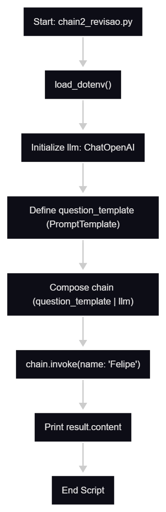
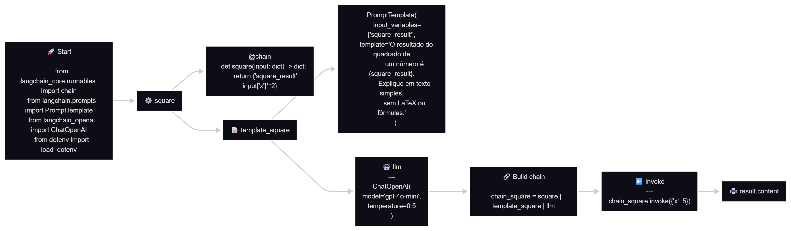
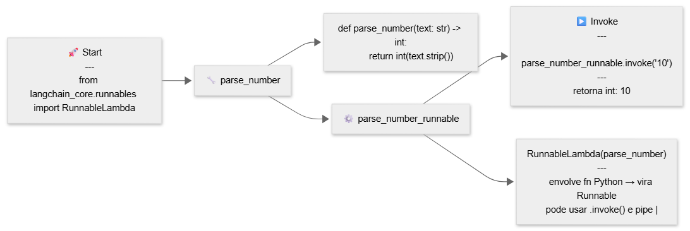
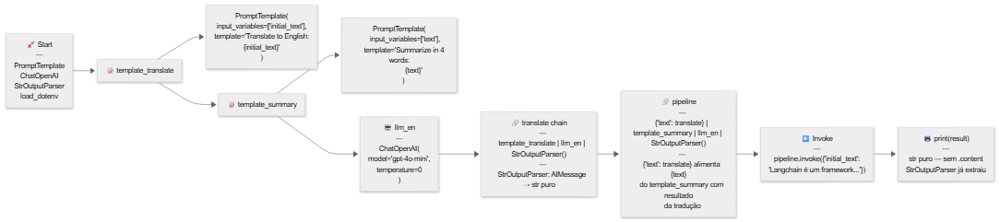

# LangChain — Fluxos de Estudo

Diagramas dos scripts de chains e processamentos com anotações laterais para facilitar revisão.

---

## 1. Chain Simples
**Script:** `chains-e-processamentos/chain2_revisao.py`

Pipeline direto: `PromptTemplate` monta prompt com `{name}` → `ChatOpenAI` gera resposta → `.content` extrai texto do `AIMessage`.

| Passo | O que faz |
|-------|-----------|
| `PromptTemplate` | Define template com variável `{name}` |
| `llm` | `ChatOpenAI(model="gpt-4o-mini", temperature=0)` |
| `chain = template \| llm` | Pipe encadeia os dois Runnables |
| `chain.invoke({"name": "Felipe"})` | Executa pipeline, retorna `AIMessage` |
| `result.content` | Extrai `str` do `AIMessage` |

---

## 2. Chain com @chain (Runnable customizado)
**Script:** `chains-e-processamentos/chain_anotacao_revisao.py`

`@chain` transforma função Python comum em Runnable. Pipeline: `square` calcula `x²` → `PromptTemplate` monta prompt com resultado → `ChatOpenAI` explica.

| Passo | O que faz |
|-------|-----------|
| `@chain def square()` | Fn Python → Runnable (pode usar `\|`) |
| `square` retorna | `{"square_result": input["x"]**2}` |
| `template_square` | `{square_result}` no template |
| `chain_square = square \| template_square \| llm` | Pipeline de 3 etapas |
| `chain_square.invoke({"x": 5})` | Calcula 5²=25, monta prompt, chama llm |

**Diferença do chain simples:** função Python customizada entra no pipeline antes do template.

---

## 3. RunnableLambda
**Script:** `chains-e-processamentos/runnable-lambda.py`

`RunnableLambda` envolve qualquer função Python em um Runnable sem precisar do decorator `@chain`.

| Passo | O que faz |
|-------|-----------|
| `def parse_number(text)` | Converte `str` → `int` via `int(text.strip())` |
| `RunnableLambda(parse_number)` | Envolve fn → vira Runnable com `.invoke()` e `\|` |
| `.invoke("10")` | Retorna `int: 10` |

**`@chain` vs `RunnableLambda`:** `@chain` é decorator direto na fn. `RunnableLambda` envolve fn existente sem alterar sua definição.

---

## 4. Pipeline de Processamento (Tradução + Resumo)
**Script:** `chains-e-processamentos/pipeline-processamento.py`

Dois templates encadeados: traduz texto PT→EN via `translate` chain, depois resume em 4 palavras via `pipeline`. `StrOutputParser` converte `AIMessage` → `str` em cada etapa.

| Passo | O que faz |
|-------|-----------|
| `template_translate` | Prompt: traduzir `{initial_text}` para inglês |
| `template_summary` | Prompt: resumir `{text}` em 4 palavras |
| `translate = template_translate \| llm \| StrOutputParser()` | Sub-chain que retorna `str` puro |
| `{"text": translate}` | Alimenta `{text}` do template_summary com output de translate |
| `StrOutputParser()` | Extrai texto do `AIMessage` — `print(result)` sem `.content` |

**Ponto-chave:** `{"text": translate}` é um dict que mapeia a variável do próximo template para o output da sub-chain anterior.
