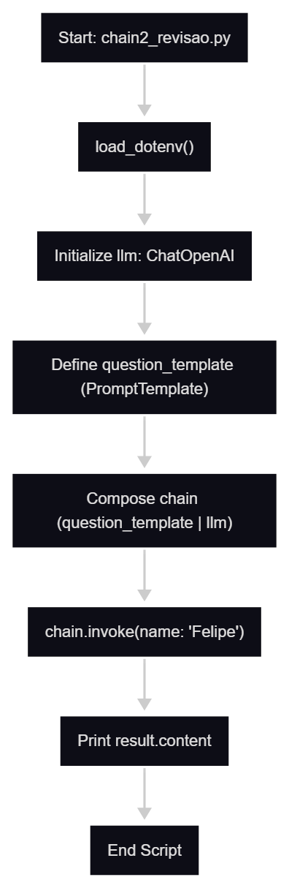
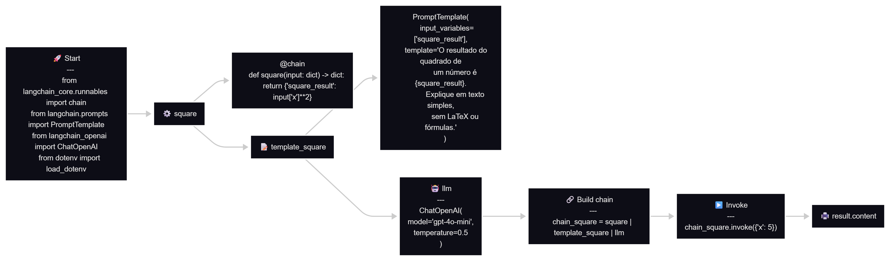
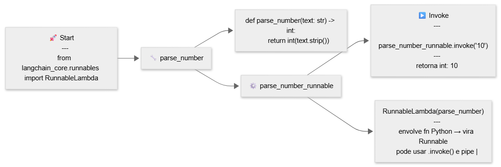
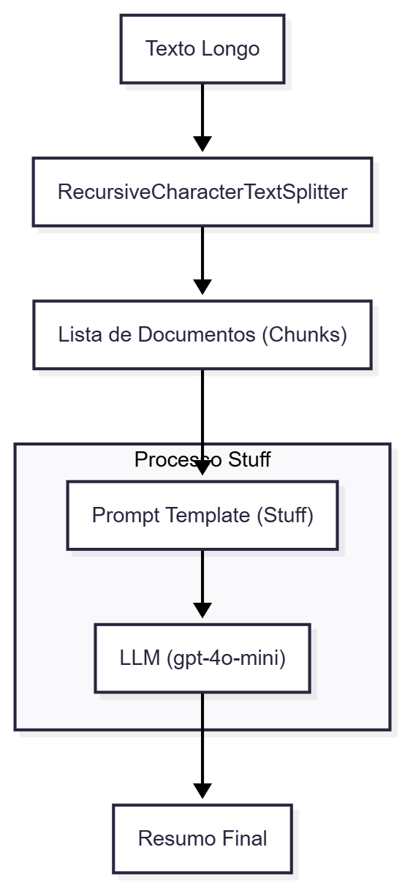
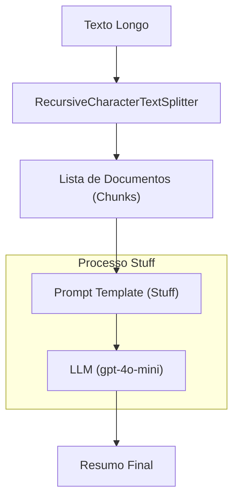
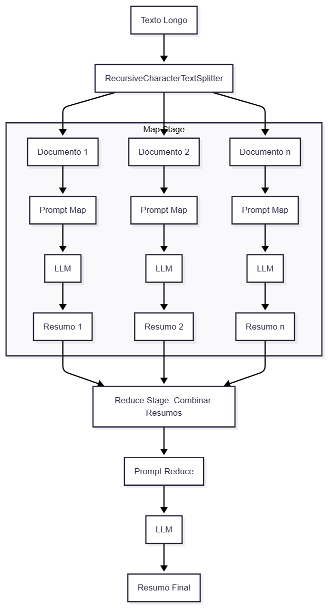
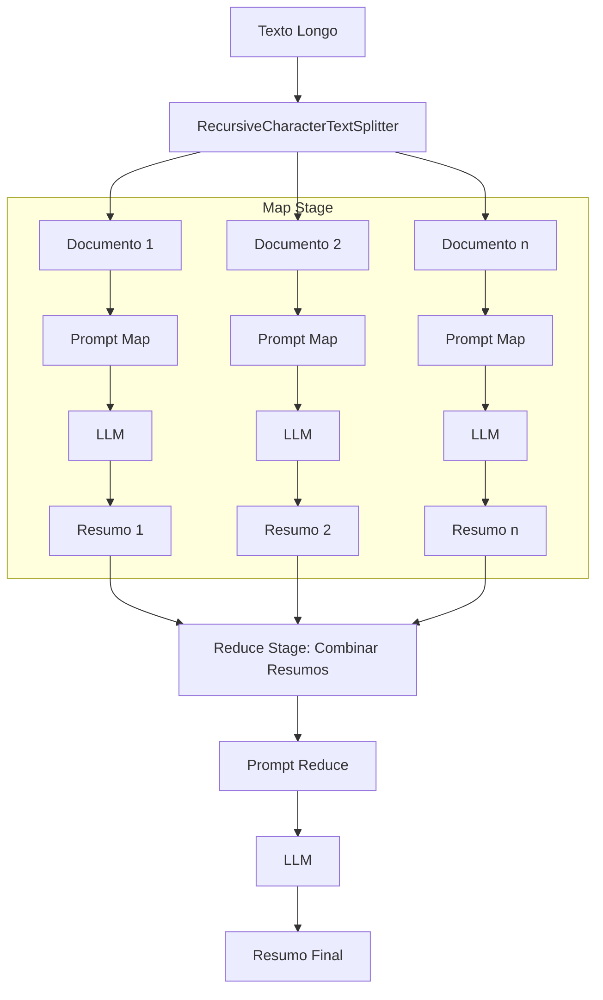
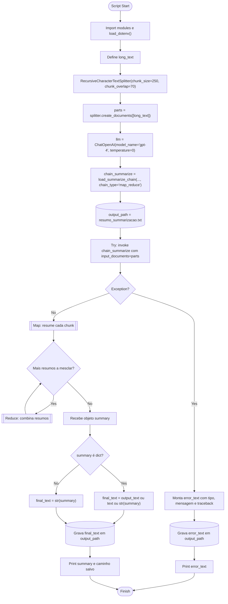

# LangChain — Fluxos de Estudo

Diagramas dos scripts de chains e processamentos com anotações laterais para facilitar revisão.

---

## 1. Chain Simples
**Script:** `chains-e-processamentos/chain2_revisao.py`

Pipeline direto: `PromptTemplate` monta prompt com `{name}` → `ChatOpenAI` gera resposta → `.content` extrai texto do `AIMessage`.

| Passo | O que faz |
|-------|-----------|
| `PromptTemplate` | Define template com variável `{name}` |
| `llm` | `ChatOpenAI(model="gpt-4o-mini", temperature=0)` |
| `chain = template \| llm` | Pipe encadeia os dois Runnables |
| `chain.invoke({"name": "Felipe"})` | Executa pipeline, retorna `AIMessage` |
| `result.content` | Extrai `str` do `AIMessage` |

---

## 2. Chain com @chain (Runnable customizado)
**Script:** `chains-e-processamentos/chain_anotacao_revisao.py`

`@chain` transforma função Python comum em Runnable. Pipeline: `square` calcula `x²` → `PromptTemplate` monta prompt com resultado → `ChatOpenAI` explica.

| Passo | O que faz |
|-------|-----------|
| `@chain def square()` | Fn Python → Runnable (pode usar `\|`) |
| `square` retorna | `{"square_result": input["x"]**2}` |
| `template_square` | `{square_result}` no template |
| `chain_square = square \| template_square \| llm` | Pipeline de 3 etapas |
| `chain_square.invoke({"x": 5})` | Calcula 5²=25, monta prompt, chama llm |

**Diferença do chain simples:** função Python customizada entra no pipeline antes do template.

---

## 3. RunnableLambda
**Script:** `chains-e-processamentos/runnable-lambda.py`

`RunnableLambda` envolve qualquer função Python em um Runnable sem precisar do decorator `@chain`.

| Passo | O que faz |
|-------|-----------|
| `def parse_number(text)` | Converte `str` → `int` via `int(text.strip())` |
| `RunnableLambda(parse_number)` | Envolve fn → vira Runnable com `.invoke()` e `\|` |
| `.invoke("10")` | Retorna `int: 10` |

**`@chain` vs `RunnableLambda`:** `@chain` é decorator direto na fn. `RunnableLambda` envolve fn existente sem alterar sua definição.

---

## 4. Pipeline de Processamento (Tradução + Resumo)
**Script:** `chains-e-processamentos/pipeline-processamento.py`

Dois templates encadeados: traduz texto PT→EN via `translate` chain, depois resume em 4 palavras via `pipeline`. `StrOutputParser` converte `AIMessage` → `str` em cada etapa.

| Passo | O que faz |
|-------|-----------|
| `template_translate` | Prompt: traduzir `{initial_text}` para inglês |
| `template_summary` | Prompt: resumir `{text}` em 4 palavras |
| `translate = template_translate \| llm \| StrOutputParser()` | Sub-chain que retorna `str` puro |
| `{"text": translate}` | Alimenta `{text}` do template_summary com output de translate |
| `StrOutputParser()` | Extrai texto do `AIMessage` — `print(result)` sem `.content` |

**Ponto-chave:** `{"text": translate}` é um dict que mapeia a variável do próximo template para o output da sub-chain anterior.

---

## 5. Sumarização Stuff
**Script:** `chains-e-processamentos/sumarizacao copy.py`

Usa a estratégia `stuff`, que coloca todos os pedaços de documentos em um único prompt. Indicado para textos curtos.

```mermaid
graph TD
    A[Texto Longo] --> B[RecursiveCharacterTextSplitter]
    B --> C["Lista de Documentos (Chunks)"]
    C --> D["Prompt Template (Stuff)"]
    D --> E["LLM (gpt-4o-mini)"]
    E --> F[Resumo Final]

    subgraph "Processo Stuff"
        D
        E
    end
```

| Passo | O que faz |
|-------|-----------|
| `RecursiveCharacterTextSplitter` | Divide o texto em chunks menores |
| `load_summarize_chain` | Carrega a chain com `chain_type="stuff"` |
| `invoke({"input_documents": parts})` | Passa a lista de docs para o modelo processar de uma vez |

---

## 6. Sumarização Map-Reduce
**Script:** `chains-e-processamentos/sumarizacao_map_reduce copy.py`

Divide o texto em partes, resume cada uma individualmente (Map) e depois condensa os resumos em um final (Reduce). Ideal para documentos longos.

```mermaid
graph TD
    A[Texto Longo] --> B[RecursiveCharacterTextSplitter]
    B --> C1[Documento 1]
    B --> C2[Documento 2]
    B --> Cn[Documento n]

    subgraph "Map Stage"
        C1 --> D1[Prompt Map] --> E1[LLM] --> F1[Resumo 1]
        C2 --> D2[Prompt Map] --> E2[LLM] --> F2[Resumo 2]
        Cn --> Dn[Prompt Map] --> En[LLM] --> Fn[Resumo n]
    end

    F1 --> G[Reduce Stage: Combinar Resumos]
    F2 --> G
    Fn --> G

    G --> H[Prompt Reduce]
    H --> I[LLM]
    I --> J[Resumo Final]
```

| Passo | O que faz |
|-------|-----------|
| `Map Step` | Cada chunk é resumido independentemente pelo modelo |
| `Reduce Step` | A LLM recebe todos os resumos intermediários e cria a síntese final |
| `load_summarize_chain` | Configurada com `chain_type="map_reduce"` |

---

## 7. Map-Reduce com Tratamento de Erros
**Script:** `map_reduce/map_reduce.py`

Implementação completa de Map-Reduce com tratamento de exceções e salvamento do resultado em arquivo. Inclui lógica para extrair o texto final de diferentes formatos de output da chain.

```mermaid
flowchart TD
    A(["Script Start"]) --> B["Import modules e load_dotenv()"]
    B --> C["Define long_text"]
    C --> D["RecursiveCharacterTextSplitter(chunk_size=250, chunk_overlap=70)"]
    D --> E["parts = splitter.create_documents([long_text])"]
    E --> F["llm = ChatOpenAI(model_name='gpt-4', temperature=0)"]
    F --> G["chain_summarize = load_summarize_chain(..., chain_type='map_reduce')"]
    G --> H[("output_path = resumo_summarizacao.txt")]
    H --> I["Try: invoke chain_summarize com input_documents=parts"]
    I --> J{"Exception?"}
    J -->|Yes| R["Monta error_text com tipo, mensagem e traceback"]
    R --> S[("Grava error_text em output_path")]
    S --> T["Print error_text"]
    T --> U(["Finish"])

    J -->|No| K[["Map: resume cada chunk"]]
    K --> K2{"Mais resumos a mesclar?"}
    K2 -->|Yes| K3[["Reduce: combina resumos"]]
    K3 --> K2
    K2 -->|No| L["Recebe objeto summary"]

    L --> M{"summary é dict?"}
    M -->|Yes| N["final_text = output_text ou text ou str(summary)"]
    M -->|No| O["final_text = str(summary)"]
    N --> P[("Grava final_text em output_path")]
    O --> P
    P --> Q["Print summary e caminho salvo"]
    Q --> U
```

| Passo | O que faz |
|-------|-----------|
| `RecursiveCharacterTextSplitter` | Divide em chunks de 250 chars com overlap de 70 |
| `chain_type="map_reduce"` | Ativa pipeline Map → Reduce automaticamente |
| `try/except` | Captura erros e grava mensagem no arquivo de saída |
| `output_path` | Salva resultado em `resumo_summarizacao.txt` |
| Extração do `final_text` | Lida com output dict ou string do chain |
